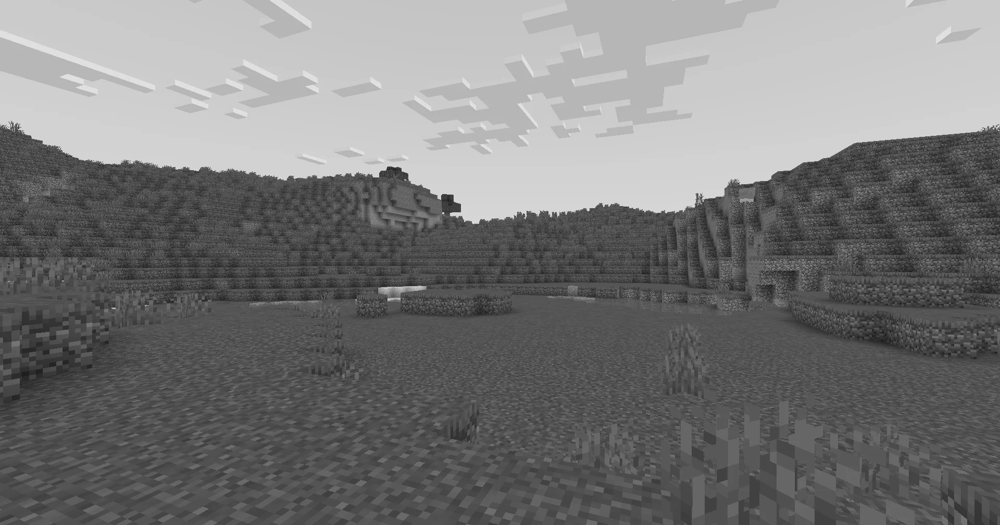

:::caution[Warning]
This tutorial is still being developed. Some statements may be incorrect, and things may change in the future. Got any feedback? [Comment on the tracking issue](https://github.com/IrisShaders/DocsPage/issues/327).
:::

## Setting Up the File Structure
Minecraft shaders require a specific structure of files in the right places to load code. While it's important to understand this structure, to save time, we will be working with the Base 330 pack from shaderLABS. Download it from [here](https://github.com/shaderLABS/Base-330), and extract it into your `shaderpacks` folder. You should have the following structure.

```
.
└── .minecraft/
		└── shaderpacks/
				└── Base-330-main/
						├── LICENSE
						├── readme.md
						└── shaders/
								└── ...
```

In this stage of the tutorial, we are going to make the screen monochrome using the `composite` pass, so let's rename the `Base-330-main` folder to `composite-tutorial`, or another name of your choosing.

You can also delete the `LICENSE` and `readme.md` files, as we don't need those.

:::caution[Warning]
It is always important to respect the license associated with code when you use it anywhere. In this case, the base pack is licensed under [The Unlicense](https://choosealicense.com/licenses/unlicense/), meaning you can do what you want with it, however other shaders may use more restrictive licenses for their code.
:::

When you select the shader in the shader selection screen, you should not see any errors in the logs.

## The `composite` Pass
For this shader, we will be using the first `composite` pass. This is a full screen pass which runs just after all gbuffers programs have rendered.

First, let's open `composite.vsh`. This is the *vertex shader* for the `composite` program. Since `composite` is a fullscreen pass, this actually just renders a singular quad (a rectangular polygon) to the screen which exactly covers it. This means that your fullscreen passes are technically actually running on 3D geometry! Specifically, the vertex shader will run four times, one for each corner of this quad.

```glsl
#version 330 compatibility

out vec2 texcoord;

void main() {
	gl_Position = ftransform();
	texcoord = (gl_TextureMatrix[0] * gl_MultiTexCoord0).xy;
}
```

Let's analyse this.

```glsl
#version 330 compatibility
```

Every shader's first line must be a version declaration. GLSL has two profiles: `compatibility` and `core`. Iris is better at patching the `compatibility` profile, so in this case there is no benefit to using `core`.

```glsl
out vec2 texcoord;
```

This is a variable declaration, but a special one. The `out` keyword means that the value will be passed to the fragment shader. The fragment shader can then have a corresponding `in` declaration which allows it to recieve this value. In older versions of GLSL, both `in` and `out` were replaced with the `varying` keyword, which people sometimes still call it.

:::note[Note]
Values passed from vertex shaders to fragment shaders are interpolated! This means that if one vertex has a value of 0, and another has a value of 1, then a pixel halfway between these two vertices will have a value of 0.5. This can be prevented by adding the `flat` keyword the `in` and `out` declarations.
:::

```glsl
void main() {
```

The `main` function is invoked when the shader program runs, just like in C.

```glsl
gl_Position = ftransform();
```

This transforms the position of the vertex from model space to clip space. The `ftransform` function is actually deprecated, but Iris patches it to the relevant modern code. For more information, see the docs on [coordinate spaces](/current/how-to/coordinate_spaces).

```glsl
texcoord = (gl_TextureMatrix[0] * gl_MultiTexCoord0).xy;
```

This gives us the 'texture coordinate' of the current vertex. This is more commonly known as the 'UV', and it is used so that the fragment shader knows where on the screen it is. These texture coordinates range from (0, 0) at the bottom left of the texture to (1, 1) at the top right.

:::tip[Swizzling]
In the previous line of code, you might have noticed some weird syntax: `.xy`. This is an operation unique to shading languages known as *swizzling*. You can read more about swizzling [here](https://www.khronos.org/opengl/wiki/Data_Type_(GLSL)#Swizzling).
:::

Let's open `composite.fsh`. This is the *fragment shader*	It runs for every pixel on the screen.

Right now the code looks like this

```glsl
#version 330 compatibility

uniform sampler2D colortex0;

in vec2 texcoord;

/* RENDERTARGETS: 0 */
layout(location = 0) out vec4 color;

void main() {
	color = texture(colortex0, texcoord);
}
```

Let's analyse this as well a bit.


```glsl
uniform sampler2D colortex0
```

This allows the shader to read from `colortex0`. Iris provides you with a number of `colortex` buffers you can read and write to. Each buffer is a texture with the same resolution as your screen. For more information on the `colortex` buffers, see the [docs](/current/reference/buffers/colortex/). `colortex0` usually contains the main scene, and we can use the other 15 for whatever we want.

```glsl
in vec2 texcoord
```

This is where we recieve the `texcoord` passed `out` in the vertex shader. This tells us what pixel to sample from `colortex0`.

```glsl
/* RENDERTARGETS: 0 */
```

This is a comment that the Iris patcher reads. It tells the shader to write back to `colortex0`. For more info, see [the docs](/current/reference/constants/rendertargets).

```glsl
layout(location = 0) out vec4 color;
```

This declares a variable `color` which at the end of the shader will be written to `colortex0`.

```glsl
color = texture(colortex0, texcoord);
```

This reads the value in `colortex0` at position `texcoord` and stores it in `color`. For more info see [the OpenGL docs](https://registry.khronos.org/OpenGL-Refpages/gl4/html/texture.xhtml).

## Making It Grayscale
A color is grayscale when the r, g, and b components all have the same value. We can compute this value by taking the dot product of the original color and a `vec3(1.0/3.0)`. This is mathematically equivalent to multiplying each channel by 1/3 and then summing the products together. If we set all three channels for color to this value, our game will be converted to grayscale.

:::tip[What's a dot product?]
If you don't know what a dot product is, you're probably new to linear algebra as well. We recommend studying up on it (or at least learning about unfamiliar concepts throughout the chapters on your own) as from this point on everything you do will be in relation to it somehow. A great place to get started is [3Blue1Brown's series of tutorials](https://www.youtube.com/playlist?list=PLZHQObOWTQDPD3MizzM2xVFitgF8hE_ab).
:::

So, after we get the value of `color`, we can do:
```glsl
float grayscale = dot(color.rgb, vec3(1.0 / 3.0));
color.rgb = vec3(grayscale);
```

Your screen should now look like this!



:::tip[Next steps]
See if you can make the screen red, or green. Using `texcoord`, can you make one half green and the other half red?
:::
