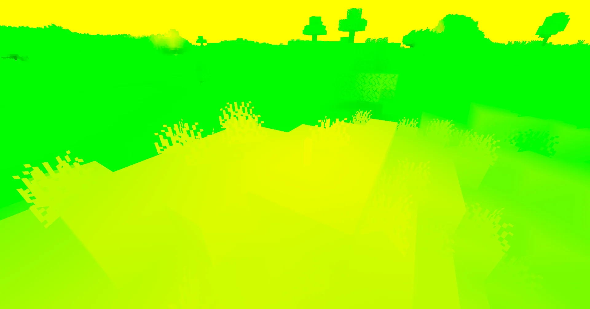
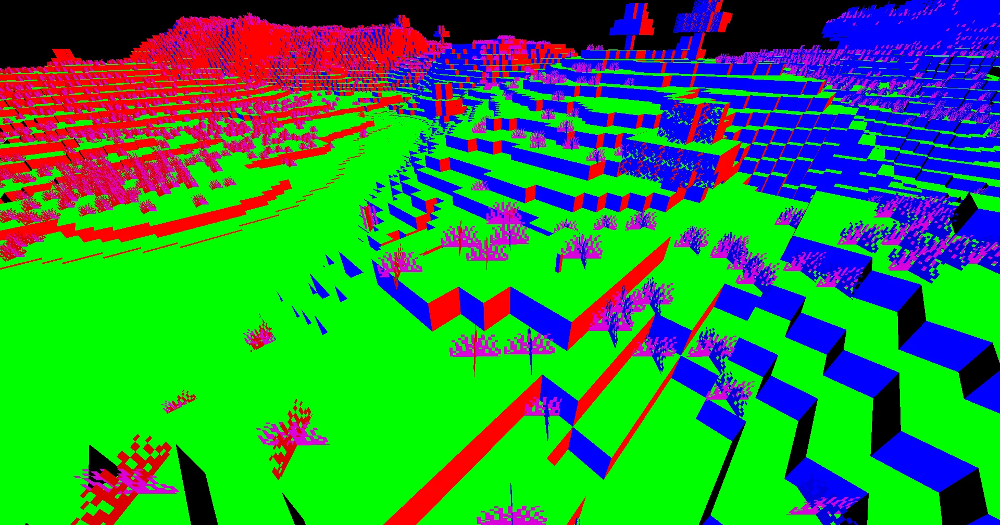
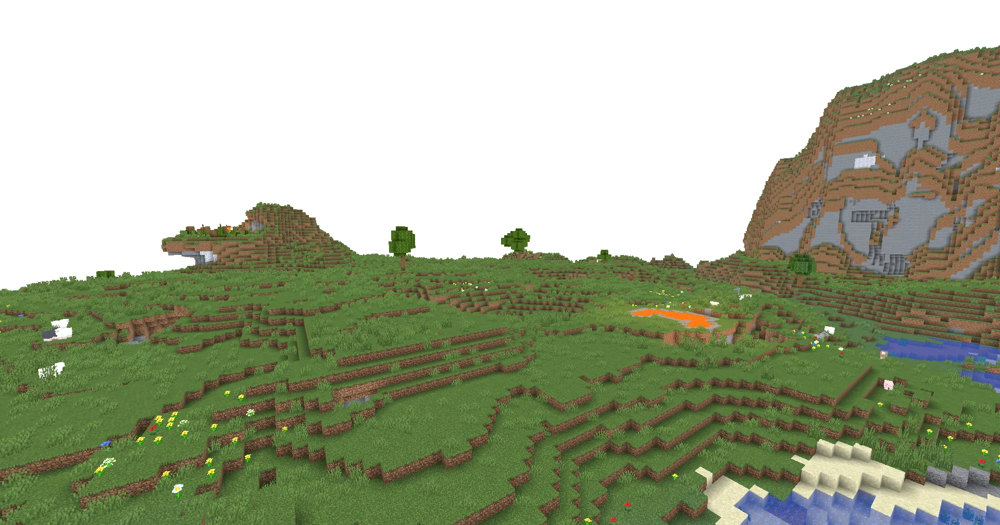
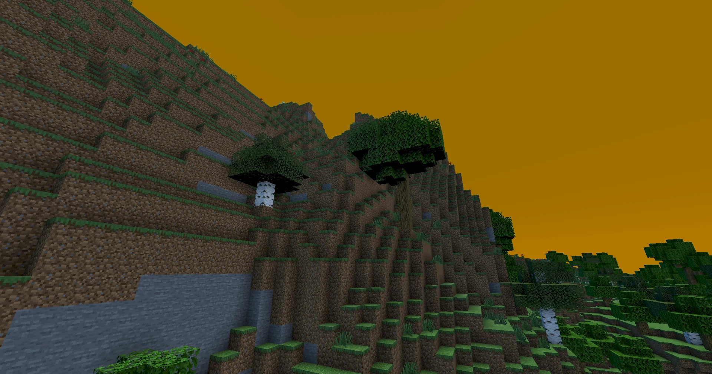
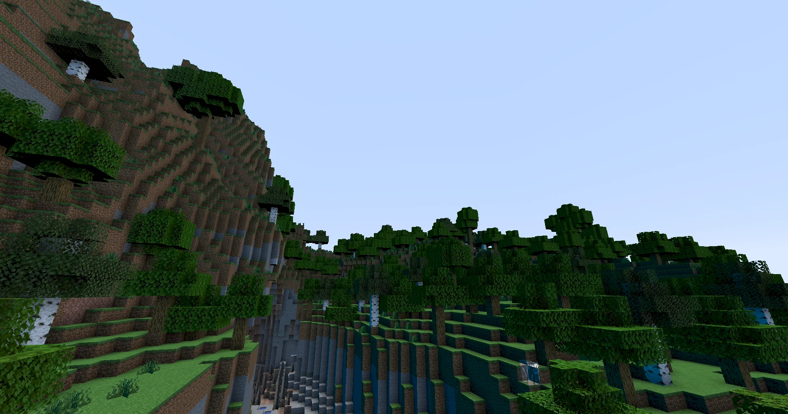

:::caution[Warning]
This tutorial is still being developed. Some statements may be incorrect, and things may change in the future. Got any feedback? [Comment on the tracking issue](https://github.com/IrisShaders/DocsPage/issues/327).
:::

In this section we will implement basic diffuse shading in the composite pass.

## Gamma Correction
Before we start doing any lighting, it's important to make sure we are in the correct color space. For more information on why we need to do this, see the relevant [LearnOpenGL article](https://learnopengl.com/Advanced-Lighting/Gamma-Correction).

Anyway, let's go back to our `gbuffers_terrain.fsh`. In order to apply gamma correction, we raise our color to the power of 2.2. So, at the end of the pass:

```glsl
color.rgb = pow(color.rgb, vec3(2.2));
```

You'll notice this makes our colors look horrible. This is because we need to apply inverse gamma correction afterwards. Let's make a new shader pass called `final`. Create copies of your `composite.fsh` and `composite.vsh` files and rename them to `final.fsh` and `final.vsh`. The `final` pass is functionally identical to the `composite` passes but it always runs after the last composite pass.

Then, in your new `final.fsh`:
```glsl
color.rgb = pow(color.rgb, vec3(1.0/2.2));
```

Voila! Your colors are back to normal.

## Decoding Data
Returning to `composite.fsh`, let's read back in the lightmap and normal data we stored in `colortex1` and `colortex2` in the previous tutorial. First, we need to be able to sample the textures.
```glsl
uniform sampler2D colortex1;
uniform sampler2D colortex2;
```

Then, in `main`, let's read them back:

```glsl
vec2 lightmap = texture(colortex1, texcoord).rg; // we only need the r and g components
vec3 encodedNormal = texture(colortex2, texcoord).rgb;
vec3 normal = normalize((encodedNormal - 0.5) * 2.0); // we normalize to make sure it is of unit length
```

Next, let's verify everything is being decoded correctly.
```glsl
color.rgb = vec3(lightmap, 0.0);
```


You can see that where there is skylight, only the green component is set. However, where there is blocklight (by the torch), the color is yellow. Since red and green make yellow in RGB, we know that blocklight is stored in the red component and sunlight is stored in the green component.

```glsl
color.rgb = normal;
```

Yep, that looks pretty *normal*. You'll notice that the sky is black here. This is because the `gbuffers_terrain` program does not run for the sky, so no data is stored for these pixels. We will resolve this later on.

## Lighting
To apply lighting to our color, we want to multiply it by the color of the light hitting it. Of course, with multiple light sources, there are multiple types of light hitting it. For our shader, we will have the following types of light
- Ambient (some constant factor, so you can see in caves)
- Skylight (blue in the day, uses the lightmap). This is our *indirect lighting*.
- Blocklight (some warm color that matches torches, uses the lightmap)
- Sun/Moonlight (yellow for the sun, white for the moon). This is our *direct lighting*.

So, to apply our lighting, we would then do something like `color.rgb *= ambient + skylight + blocklight + sunlight`.

First, let's define some colors/brightnesses for each term. I chose the following on a whim.
```glsl
const vec3 blocklightColor = vec3(1.0, 0.5, 0.08);
const vec3 skylightColor = vec3(0.05, 0.15, 0.3);
const vec3 sunlightColor = vec3(1.0);
const vec3 ambientColor = vec3(0.1);
```

I have defined these before `main`, they are `const`s which means they are defined at compile time, making them faster.

Let's get these values applied.

```glsl
vec3 blocklight = lightmap.r * blocklightColor;
vec3 skylight = lightmap.g * skylightColor;
vec3 ambient = ambientColor;
vec3 sunlight = sunlightColor; // we will fix this in a minute

color.rgb *= blocklight + skylight + ambient + sunlight;
```

Things should look something like this:


## Sunlight
Now, what about that sunlight? Well, if something is facing directly towards the sun, then we want it to be fully sunlit. On the other hand, if something is facing away from the sun, we want there to be no sunlight. So, we need a function that returns 1.0 if two vectors are facing in the same direction, and 0.0 if they are facing away from each other. Happily, we can use a dot product for this.

Now, the first thing we need to know is where the sun (or moon) is. We can do this with `uniform vec3 shadowLightPosition`. In the daytime this returns the sun's position, in the night, this returns the moon's position.

Now, to get a vector pointing towards this, we can *normalize it*. This maintains the direction but ensures the magnitude is 1. However, this vector is in view space, and our normal is in world space. To transform our normal to world space, we once again use `uniform mat4 gbufferModelViewInverse`.

:::note[Note]
We store the normal in world space because by default, `colortex` buffers are 8 bit. This means that each axis can only have 256 possible values. Since in view space, normals are relative to the orientation of the camera, the normal will change as the camera rotates, and with this limited number of combinations, any lighting we do based on the normal may appear to flicker as the camera rotates. Storing the normal in world space ensures that the normal is the same at any viewing angle.
:::

Once we have the sun vector, we can take the dot product of it with the normal, and multiply the sunlight by it. We will also multiply by the sky lightmap, as stuff which is not lit by the sky should not be lit by the sun either (we will replace this with shadows in the next section). This would look something like this:

:::note[Note]
The dot product should be clamped between 0 and 1 because we cannot have negative sunlight.
:::

```glsl
vec3 lightVector = normalize(shadowLightPosition);
vec3 worldLightVector = mat3(gbufferModelViewInverse) * lightVector;

[...]

vec3 sunlight = sunlightColor * clamp(dot(worldLightVector, normal), 0.0, 1.0) * lightmap.g;
```

With that change, your lighting should seem a bit more realistic.



## Fixing the sky
At this point, it may appear as if your Minecraft world is currently undergoing an apocalypse. This is because we are also applying lighting to the sky, despite the fact we do not have normal or lightmap data for it. So, how do we tell if a pixel is the sky or not? Well, we have access to something called the depth buffer, which tells you how far away a pixel is. If the pixel is at the maximum view distance, the depth buffer will store 1.0.

To access the depth buffer, we use `uniform sampler2D depthtex0`. In between the code which reads the color from `colortex0` and the code which applies lighting, we can check if the pixel is the sky, and if it is, we can `return` from the `main` function.

```glsl
float depth = texture(depthtex0, texcoord).r;
if(depth == 1.0){
	return;
}
```

:::note[Note]
The depth is not stored in a linear format. This means that while a pixel that is as close as it can be is at 0, and a pixel that is as far away as it can be is 1, a pixel halfway between will not have a depth of 0.5. The reason for this will not be covered here, but a function to convert to linear depth can be found on the [shaderLABS wiki](https://shaderlabs.org/wiki/Shader_Tricks#Linearizing_depth).
:::

Having done that, your Minecraft world should hopefully have been saved from the apocalypse.

