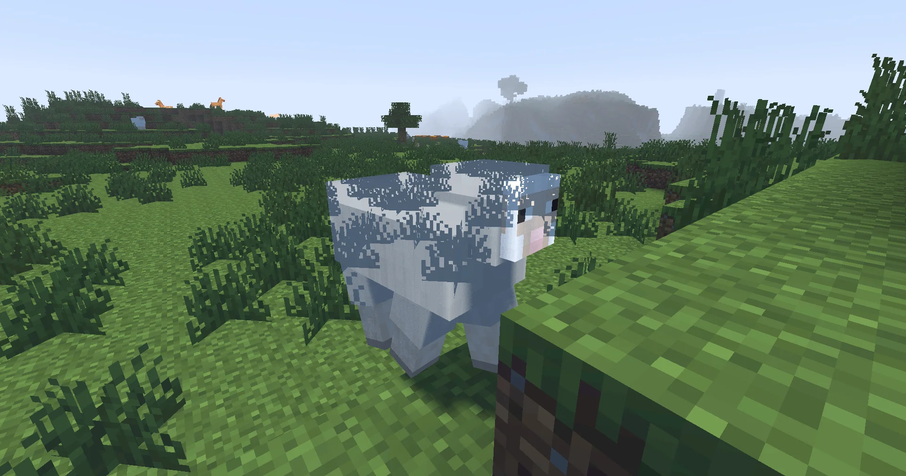

This is as far as we go with the tutorial, but there's plenty more that can be done with the shader!

## Issues to Fix
### "Transparent" Entities

Right now, our entities appear partially translucent. This is because we have only written a `gbuffers_terrain` program. Entities are handled by `gbuffers_entities`, which falls back to `gbuffers_textured_lit`. Since we have not overriden this program, it doesn't write our normals or lightmap data to the buffers we need it to. An easy way to resolve this is to rename `gbuffers_terrain` to `gbuffers_textured_lit`, which most programs we care about will fall back to. For more information, see [Gbuffers](/current/reference/programs/gbuffers/).

### Bright Night
Since our sunlight and skylight colors are constant, things are still very well lit at night. This can be improved by varying the skylight and sunlight colors based on the time of day. We can do this using the uniform [`worldTime`](/current/reference/uniforms/world#worldtime).

## Things to Do
Here are some things you could try adding to your shader next. Some of these are more complex than others, and may require additional research into graphics programming.

:::caution[Warning]
**None of the resources linked to are Minecraft specific!** You will need to modify the code they provide quite significantly to make it work in your shaderpack. **Do not expect to be able to just copy and paste code and have it work**.
:::

- A custom sky, using a simple gradient based on the time of day, or even a physically based atmosphere
- Waving water and foliage
- Better shadow filtering, using [interleaved gradient noise](https://blog.demofox.org/2022/01/01/interleaved-gradient-noise-a-different-kind-of-low-discrepancy-sequence/) and a [Vogel disk](https://www.shadertoy.com/view/tddXWl)
- A [tonemap](https://64.github.io/tonemapping/)
- Clouds
- Specular shading, using something like [Blinn-Phong shading](https://learnopengl.com/Advanced-Lighting/Advanced-Lighting) or at a more advanced level, the [Cook-Torrance BRDF](https://learnopengl.com/PBR/Theory)
- [Screen Space Ambient Occlusion (SSAO)](https://learnopengl.com/Advanced-Lighting/SSAO)
- [Screen Space Reflections](https://lettier.github.io/3d-game-shaders-for-beginners/screen-space-reflection.html)
- [Bloom](https://learnopengl.com/Advanced-Lighting/Bloom). Most modern packs do [bloom in HDR](https://learnopengl.com/Guest-Articles/2022/Phys.-Based-Bloom), which will require you to use a [floating point buffer format](current/reference/constants/buffer_format/) and store every "mip level" in a single texture.

## Resources
- The [shaderLABS discord](https://discord.gg/RpzWN9S) has some resources on shader development, but also has channels where you can ask for help if you're stuck on something.
- Some items in this [list of resources by Bálint](https://blog.balintcsala.com/posts/resources/) are also useful.
- The Iris docs are incomplete, so if you can't find something, you may be able to find it in the [OptiFine Documentation](https://github.com/sp614x/optifine/blob/master/OptiFineDoc/doc/shaders.txt) or [ShaderDoc](https://github.com/IrisShaders/ShaderDoc).