:::caution[Warning]
This tutorial is still being developed. Some statements may be incorrect, and things may change in the future. Got any feedback? [Comment on the tracking issue](https://github.com/IrisShaders/DocsPage/issues/327).
:::

In this section we will implement basic shadow mapping which allows us to check if a pixel has a shadow cast on it.

## The `shadow` Pass
The first thing we need to do is create two new files: `shadow.vsh` and `shadow.fsh`. They should be in the `shaders` folder, just like your other shader programs.

These compose the 'shadow pass', which runs before the gbuffers passes. It renders the scene from the perspective of the sun (or moon), storing depth and color information which we can use for shadow mapping. 

The shadow programs can actually be pretty much copies of your `gbuffers_terrain` programs. They will function the same, however less info needs to be passed through, so if you want, you can delete the extra `in` and `out` declarations we aren't using. The only ones we need are `texcoord` and `glcolor`.

```glsl
// shadow.vsh

#version 330 compatibility

out vec2 texcoord;
out vec4 glcolor;

void main() {
	texcoord = (gl_TextureMatrix[0] * gl_MultiTexCoord0).xy;
	glcolor = gl_Color;
	gl_Position = ftransform();
}
```
```glsl
// shadow.fsh
#version 330 compatibility

uniform sampler2D gtexture;

in vec2 texcoord;
in vec4 glcolor;

layout(location = 0) out vec4 color;

void main() {
	color = texture(gtexture, texcoord) * glcolor;
	if(color.a < 0.1){
		discard;
	}
}
```

:::caution[Warning]
Notice that there is no `DRAWBUFFERS` declaration in the fragment shader. This is because the buffers you write to from the shadow pass are predetermined, and you cannot write to `colortex` buffers from it. By writing to location 0, we are writing to `shadowcolor0`. By default we can write to `shadowcolor0` and `shadowcolor1`.
:::

This is actually all we need to get Iris rendering a shadow map. Let's now go back to our `composite` pass.

## Reading the Shadow Map
The shadow map is accessable as `shadowtex0`, so let's add this as a `sampler2D`.

```glsl
uniform sampler2D shadowtex0;
```

First, to make sure things are working properly, let's render the shadow map to the screen.

```glsl
color.rgb = texture(shadowtex0, texcoord).rgb;
```

You should see something like this:
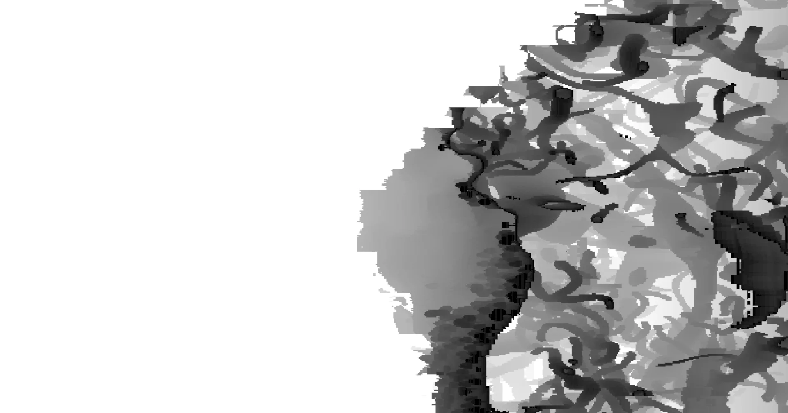

This may not make much sense to look at, but this shows how far away the nearest thing the sun can see is. 

:::note[Note]
You might be able to see parts of your terrain disappearing from the shadow map as the camera angle changes. This is because of something called culling, where Iris determines which bits of terrain can't cast shadows anywhere we can see, and therefore does not render them. This saves on performance without any visual difference.
:::

## Getting the Position in Shadow Space
To check if a pixel is shadowed, we need to know where in the shadow map it is. We can do this by transforming the position of the pixel into *shadow space*. We will need the following transformation matrices:

```glsl
uniform mat4 gbufferProjectionInverse;
uniform mat4 gbufferModelViewInverse;
uniform mat4 shadowModelView;
uniform mat4 shadowProjection;

```

To do this, we first need to determine the position of the pixel at all. We can do this using the screen texture coordinate, as well as the depth. For more information on these space conversions, see [Coordinate Spaces](/how_to/coordinate-spaces).

To do these space conversions, we will make use of a function, `projectAndDivide`. This function applies a projection matrix and then divides by the `w` component, skipping clip space. **Place this function definition outside and before `main` but after the declaration of `texcoord`.**

```glsl
vec3 projectAndDivide(mat4 projectionMatrix, vec3 position){
	vec4 homPos = projectionMatrix * vec4(position, 1.0);
	return homPos.xyz / homPos.w;
}
```

Then, for our space conversion:

```glsl
vec3 NDCPos = vec3(texcoord.xy, depth) * 2.0 - 1.0;
vec3 viewPos = projectAndDivide(gbufferProjectionInverse, NDCPos);
vec3 feetPlayerPos = (gbufferModelViewInverse * vec4(viewPos, 1.0)).xyz;
vec3 shadowViewPos = (shadowModelView * vec4(feetPlayerPos, 1.0)).xyz;
vec4 shadowClipPos = shadowProjection * vec4(shadowViewPos, 1.0);
vec3 shadowNDCPos = shadowClipPos.xyz / shadowClipPos.w;
vec3 shadowScreenPos = shadowNDCPos * 0.5 + 0.5;
```

We can then sample the shadow map at `shadowScreenPos`.

## Sampling the Shadow Map
So, the shadow map contains the depth of the nearest thing to the light source in that direction. Therefore, if something is further away from the sun, it must be in shadow. What we do is compare the depth in the shadow map at our shadow position's xy component to the z component of our shadow position. If the z component is not greater than the depth, it must be in sunlight. We can do this comparison with the `step` function. Let's say we have `step(a, b)`. It returns 1.0 if `b` is more than `a`. With that in mind, we can declare:

```glsl
float shadow = step(shadowScreenPos.z, texture(shadowtex0, shadowScreenPos.xy).r);
```

We can then replace our multiplication by `lightmap.g` with one by `shadow`.

```glsl
vec3 sunlight = sunlightColor * dot(normal, worldLightVector) * shadow;
```

You should now see something like this:

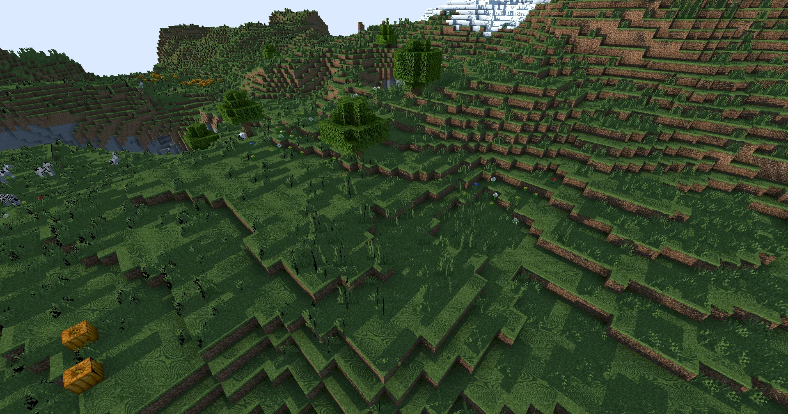

Now, while you can tell that things are casting shadows, a lot of surfaces seem to be in shadow when they shouldn't be, with weird patterns. This is due to something called 'shadow acne', and it occurs when something ends up casting a shadow on itself due to the lack of precision in the shadow map. We can fix this by adding something known as 'shadow bias' where we offset surfaces slightly towards the sun to prevent them casting shadows on themselves:

```glsl
[...]
vec4 shadowClipPos = shadowProjection * vec4(shadowViewPos, 1.0);
shadowClipPos.z -= 0.001;
vec3 shadowNDCPos = projectAndDivide(shadowProjection, shadowViewPos);
[...]
```

Your shadows should now look a lot more reasonable.

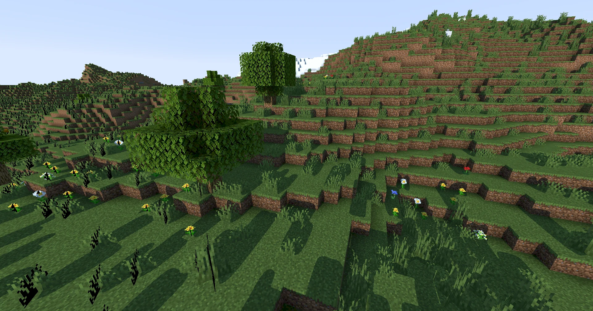

## Making Shadows Sharper
At the moment, our shadows are extremely blocky. This is due to the limited resolution of the shadow map. We can improve things somewhat by increasing this, using the [`shadowMapResolution`](/reference/constant/shadowmapresolution) const. This constant can be defined anywhere, but just because it's a nice place to put it, we'll go back to `shadow.fsh`. Let's add the following. It should be outside the `main` function - I put mine just before my `layout` qualifier declaration.

```glsl
const int shadowMapResolution = 2048;
```

This makes things a little bit sharper, but they still don't look great.

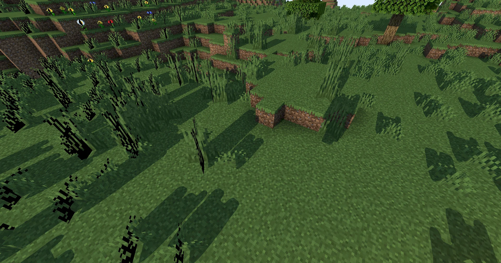

The easy solution here would be to just increase the shadow map resolution to some very big number like 8192 (it is convention to use a power of two for your shadow map size), but this will start taking up an awful lot of video memory, causing a performance impact. Instead, we can make use of something known as 'shadow distortion'. The idea is that since stuff that is closer to us is what we can see most clearly, we want to dedicate more of the shadow map resolution to this stuff, and less of it to things that are further away.

## Shadow Distortion

:::note[Note]
Shadow distortion as we are applying it is quite an old technique, and does not work as well as other, more modern methods for optimising use of shadow maps like [Cascaded Shadow Maps](https://learnopengl.com/Guest-Articles/2021/CSM). For example, it tends to create large blobs of shadow on the centre of triangles, because GPUs can't draw curved triangles. However, due to the limitations of the Optifine/Iris pipeline, it's quite hard to do anything more advanced, so this is what we are sticking with.
:::

For our shadow distortion, we want to scale things to make stuff closer to the player occupy more space in the shadow map, squashing the stuff that's further away towards the edges. We are going to do this operation in *shadow clip space*. Let's make a new function which takes in a position in shadow screen space, distorts it, and returns it. We want to access this function within both `shadow.vsh` and `composite.fsh`, so we are going to make use of a GLSL feature called `#include`. This lets us include code from one file inside multiple other files.

:::note[Note]
`#include` is a *preprocessor directive*. This means it runs when your code is compiled. When the GLSL compiler finds this directive, it replaces it with the contents of the specified file.
:::

Let's make a new file called `distort.glsl`. We'll put it in a folder called `lib` for the sake of organisation.
```glsl
.
└── shaders/
    ├── lib/
    │   └── distort.glsl
    ├── composite.fsh
    └── ...
```

We can then add 
```glsl
#include /lib/distort.glsl
```
to our `shadow.vsh`. *This should be included before the `main` function, as you cannot define functions within a function. I put mine just before my `out` declarations.

**We should also move our declaration of `shadowmapresolution` to `distort.glsl`.** This way, we can access this variable anywhere we are sampling the shadow map.

:::caution[Warning]
Preprocessor directives *do not have a semicolon on the end*.
:::

Within `distort.glsl`, let's write a function `distortShadowClipPos`. This function is the one we described earlier.

So, how do we actually distort the position? Well, in shadow clip space, all positions are between `-1.0` and `1.0`. Now, as the distance from the position to the origin (where the player is) increases, we want to make that distance even greater by pushing it closer to the edge. What we can do is *divide the position by the distance to the origin*.

```glsl
// /lib/distort.glsl

vec3 distortShadowClipPos(vec3 shadowClipPos){
	float distortionFactor = length(shadowClipPos.xy); // distance from the player in shadow clip space
	distortionFactor += 0.1; // very small distances can cause issues so we add this to slightly reduce the distortion

	shadowClipPos.xy /= distortionFactor;
  shadowClipPos.z *= 0.5; // increases shadow distance on the Z axis, which helps when the sun is very low in the sky
	return shadowClipPos;
}
```

:::caution[Warning]
We do not apply distortion to the `z` component as the origin of shadow clip space is the sun, not the player. On the `x` and `y` axes, things line up fine anyway, but on the `z` axis, they do not. Instead, we just half the `z` component, which essentially doubles the range on this axis, at the cost of precision. This is because when the sun gets low in the sky, the normal range of 255 blocks becomes noticeable.
:::

We now need to apply that distortion. Back in `shadow.vsh`, `gl_Position` is in clip space, so we can simply apply it to the `xyz` component.

```glsl
//shadow.vsh

void main(){
	[...]
	gl_Position = ftransform();
	gl_Position.xyz = distortShadowClipPos(gl_Position.xyz);
}
```

At this point, let's write the shadow map to the screen again to check what it looks like now. We did this earlier on, so I'll not give you the code again.

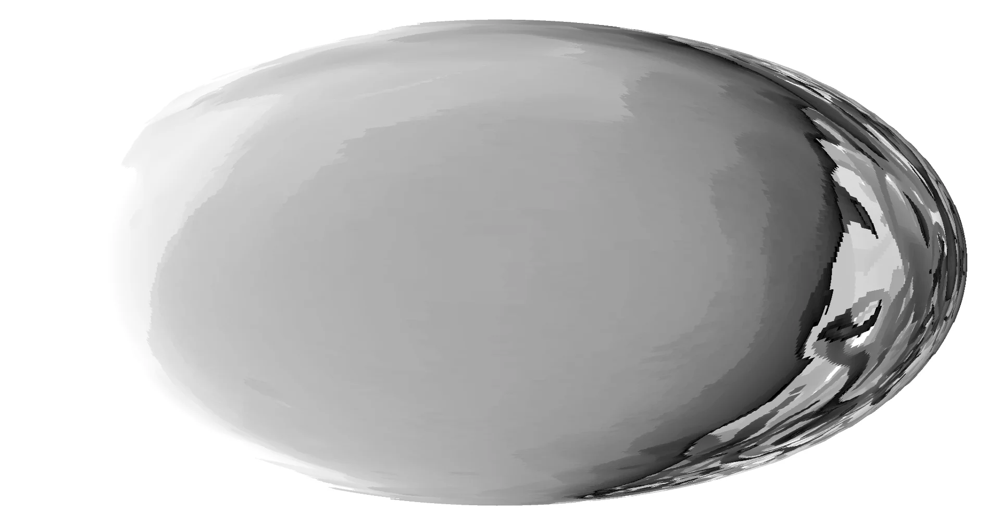

As expected, stuff in the middle of the shadow map has been expanded to take up more space!

To apply this distortion when sampling the shadow map, we will `#include /lib/distort.glsl` in `composite.fsh`, and then apply the distortion to our shadow clip position *after the bias*.

```glsl
// composite.fsh

[...]
vec4 shadowClipPos = shadowProjection * vec4(shadowViewPos, 1.0);
shadowClipPos.z -= 0.001; // bias
shadowClipPos.xyz = distortShadowClipPos(shadowClipPos.xyz); // distortion
vec3 shadowNDCPos = shadowClipPos.xyz / shadowClipPos.w;
[...]
```

Our shadows now look nice and sharp near the player!

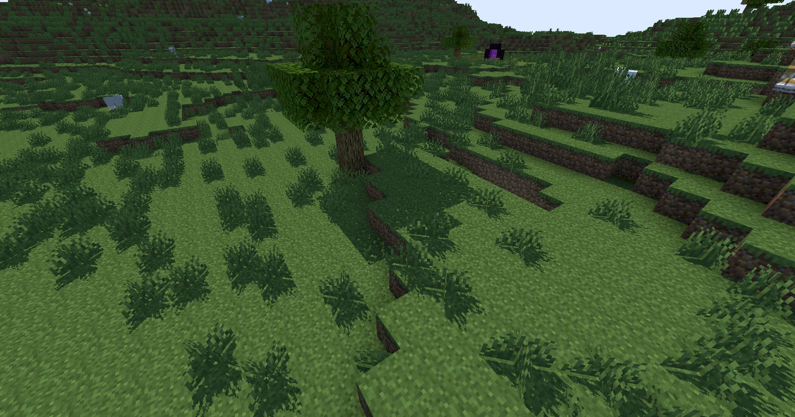

## Transparent Shadows
If you look at something like stained glass, you'll see that it casts a solid shadow. This doesn't really make sense, since (it being partially translucent) it should be letting some light through. Handily, there are a couple of extra shadowmaps we can access to help us with this.

- `shadowtex0` contains everything that casts a shadow
- `shadowtex1` contains only things which are *fully opaque* and cast a shadow
- `shadowcolor0` contains the color (including how transparent it is) of things which cast a shadow.

With these three shadow maps, we can work out how much shadow is being cast by something, and even what color that shadow should be!

Let's go back to `composite.fsh` and make a new function called `getShadow`. It should take in a `shadowScreenPos` which is of course a `vec3`. As The logic we will use is as follows:

```glsl

vec3 getShadow(vec3 shadowScreenPos){
	float transparentShadow = step(shadowScreenPos.z, texture(shadowtex0, shadowScreenPos.xy).r);

	// note that a value of 1.0 means 100% of sunlight is getting through, not that there is 100% shadowing

	if(transparentShadow == 1.0){ // no shadow at all
		return vec3(1.0);
	}

	float opaqueShadow = step(shadowScreenPos.z, texture(shadowtex1, shadowScreenPos.xy).r);

	if(opaqueShadow == 0.0){ // opaque shadow so don't sample transparent shadow color
		return vec3(0.0);
	}

	vec4 shadowColor = texture(shadowcolor0, shadowScreenPos.xy);

	return shadowColor.rgb * (1.0 - shadowColor.a); // the transparency of the caster is stored in shadowcolor0's alpha component
}
```

We can then replace our original
```glsl
float shadow = step(shadowScreenPos.z, texture(shadowtex0, shadowScreenPos.xy).r);
```
with
```
vec3 shadow = getShadow(shadowScreenPos);
```

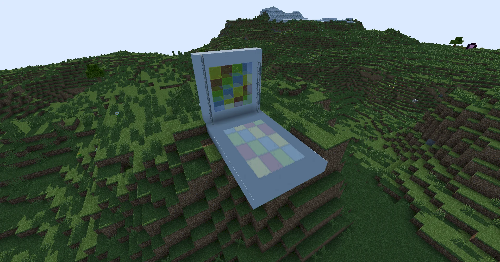

and we now get nice colored shadows!

## Softer Shadows
The final piece of the puzzle is those nasty jagged edges on our shadows. This is called *aliasing*, and is another artifact of the limited resolution on our shadow map. If you look at real shadows, you'll also notice that they don't tend to have clean, sharp edges. Instead, they seem to have a slightly softer edge. This area at the edge of the shadow is known as the *penumbra*.

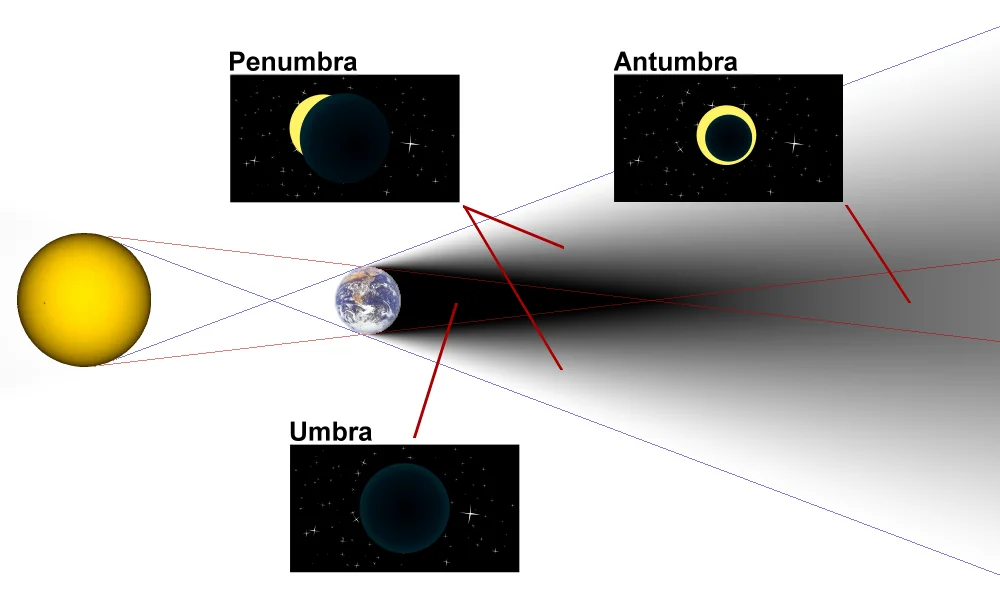
[Image Source: Wikipedia](https://commons.wikimedia.org/w/index.php?curid=3675853)

What this means is that we can blur our shadows slightly, and not only will it remove the aliasing, it will also make them more physically plausible.

The first thing we are going to do is add the following to `distort.glsl`, just after we set the resolution.
```glsl
// distort.glsl
const bool shadowtex0Nearest = true;
const bool shadowtex1Nearest = true;
const bool shadowcolor0Nearest = true;
```

This will remove the curved edges on the shadows, making them even more jagged, but it's necessary for us to be able to correctly blur them, and also resolves some artifacts on transparent shadows you may have noticed.

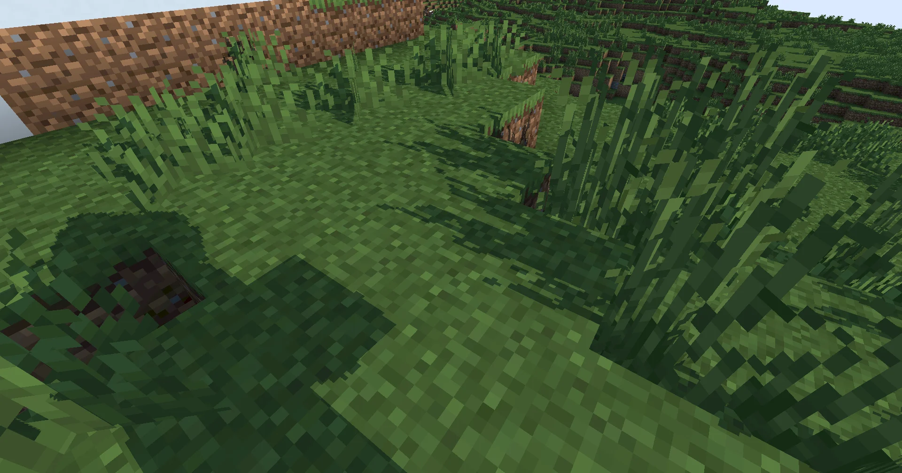

To blur our shadows, we are going to be using something known as *percentage closer filtering*. To do this, we take multiple shadow samples within an area around the position and average them. To do this, we will be using a loop. Within this loop, we will generate an offset from the shadow position, apply it in clip space, and then convert to screen space before our shadow samples. 

First, we should define how many samples we are going to take, and how far we should offset our samples. We can do this with a preprocessor directive which we can later make configurable in the settings menu.

```glsl
#define SHADOW_QUALITY 2
#define SHADOW_SOFTNESS 1
```
:::note[Note]
`#define` is another preprocessor directive, except instead of replacing itself with the contents of a file, it replaces all uses of it with the value. For example, if we `#define THING 2.0`, then `float something = thing;` will compile to `float something = 2.0`.
:::

Let's define another function `getSoftShadow` in `composite.fsh`. This function will call `getShadow` so it must be placed after it.

:::caution[Warning]
This is a pretty big function that's simply provided here. You should make sure you understand what each line does using the comments before you copy paste it into your codebase.
:::

```glsl
vec3 getSoftShadow(vec4 shadowClipPos){
	const float range = SHADOW_SOFTNESS / 2; // how far away from the original position we take our samples from
	const float increment = range / SHADOW_QUALITY; // distance between each sample

	vec3 shadowAccum = vec3(0.0); // sum of all shadow samples
	int samples = 0;

	for(float x = -range; x <= range; x += increment){
		for (float y = -range; y <= range; y+= increment){
			vec2 offset = vec2(x, y) / shadowMapResolution; // we divide by the resolution so our offset is in terms of pixels
			vec4 offsetShadowClipPos = shadowClipPos + vec4(offset, 0.0, 0.0); // add offset
			offsetShadowClipPos.z -= 0.001; // apply bias
			offsetShadowClipPos.xyz = distortShadowClipPos(offsetShadowClipPos.xyz); // apply distortion
			vec3 shadowNDCPos = offsetShadowClipPos.xyz / offsetShadowClipPos.w; // convert to NDC space
			vec3 shadowScreenPos = shadowNDCPos * 0.5 + 0.5; // convert to screen space
			shadowAccum += getShadow(shadowScreenPos); // take shadow sample
			samples++;
		}
	}

	return shadowAccum / float(samples); // divide sum by count, getting average shadow
}
```

We can then remove some of our conversion code and replace our call to `getShadow` with a call to `softShadow`.

```glsl
//composite.fsh

[...]
vec4 shadowClipPos = shadowProjection * vec4(shadowViewPos, 1.0);

// note how subsequent conversion code has been moved to the getSoftShadow function

vec3 shadow = getSoftShadow(shadowClipPos);
[...]
```

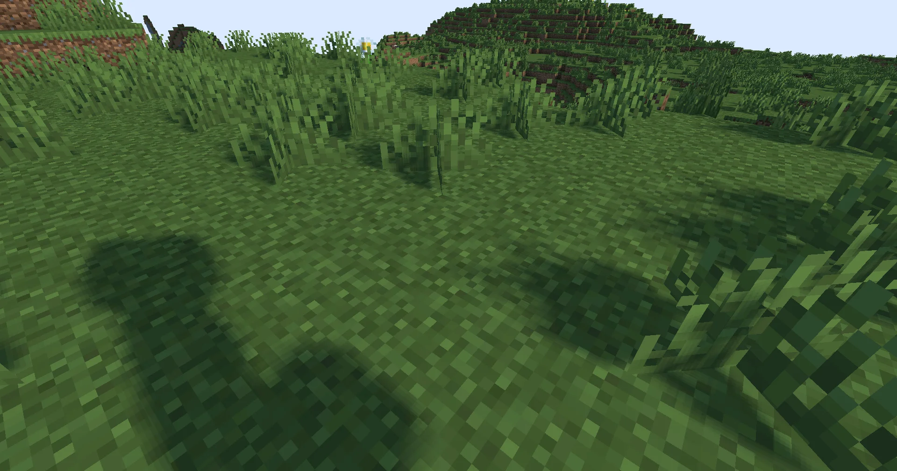

Our shadows now have soft edges, and the aliasing artifacts are no longer visible. However, they still look a little bit pixelated. This is for two reasons. The first one is that we are using a box kernel, which means that we are sampling evenly within a square box. Ideally, a circular kernel would be used, however implementing this is left as an exercise to the reader. The second, more important reason is that we are sampling the exact same points for every pixel on screen. We can resolve this issue by randomly rotating the area we sample within for each frame. We can get a random rotation using another texture, [`noisetex`](/reference/buffers/noisetex/). Let's write `noisetex` to the screen. I'm once again leaving this up to you to do, because we've written a fair few textures to the screen at this point. Like every other texture, `noisetex` is declared with a `uniform sampler2D noisetex;`.

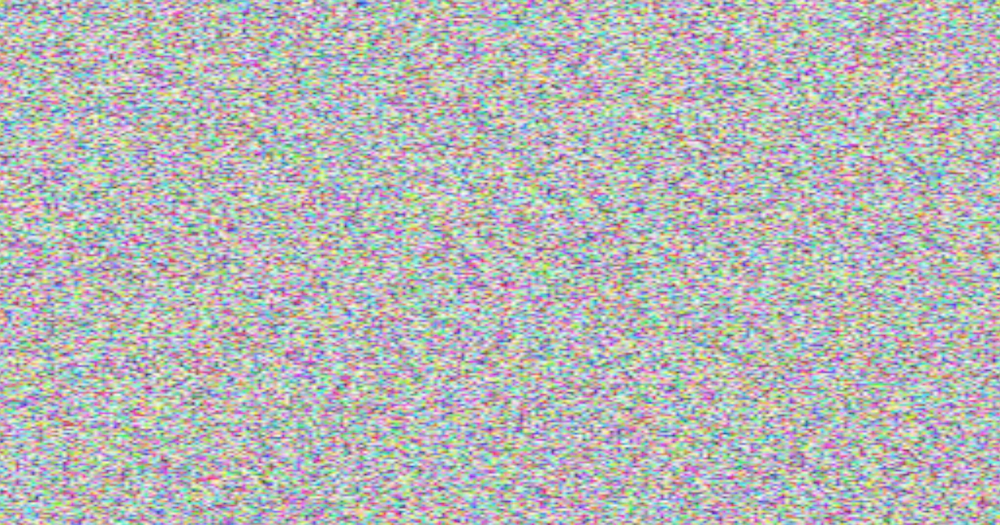

You'll see the pixels in `noisetex` are pretty chunky. This is because it has a resolution of 64x64, and is being stretched to fit the screen. We could just increase the resolution, but to ensure we're getting a unique value for every pixel, we'll instead use a function called `texelFetch`. `texelFetch` takes in an exact pixel coordinate in a texture and returns the value there without doing any filtering. We will need to convert our `texcoord` to a pixel coordinate within the range (0-64). We can do this using another couple of uniforms, [`viewWidth`](/reference/uniforms/general/viewwidth/) and [`viewHeight`](/reference/uniforms/general/viewheight/) (both `float`s). We will also make use of the type `ivec2` which is like a `vec2` except it can store only integer values. Let's make another new function called `getNoise`. It will take in a vec2 texcoord and return a vec4, the lookup value from `noisetex`. We're going to access it in `getSoftShadow` so it should be placed before this function.

```glsl
vec4 getNoise(vec2 coord){
	ivec2 screenCoord = ivec2(coord * vec2(viewWidth, viewHeight)); // exact pixel coordinate onscreen
	ivec2 noiseCoord = screenCoord % 64; // wrap to range of noiseTextureResolution
	return texelFetch(noisetex, noiseCoord, 0);
}
```

:::note[Note]
`64` is the default resolution of `noisetex`. Since this value can be configured with [`noiseTextureResolution`](/reference/constants/noisetextureresolution/), if you ever change this value, you should replace the use of `64` with the uniform.
:::

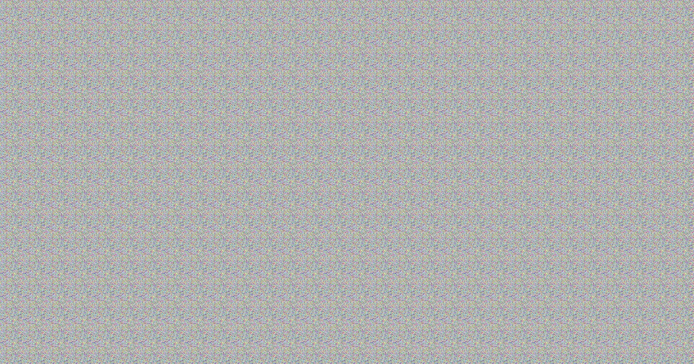

While the image clearly repeats, we now have unique values per pixel for the noise. We can then modify our `softShadow` function to take this into account.

```glsl
vec3 getSoftShadow(vec4 shadowClipPos){
	const float range = SHADOW_SOFTNESS / 2; // how far away from the original position we take our samples from
	const float increment = range / SHADOW_QUALITY; // distance between each sample

	float noise = getNoise(texcoord).r;

	float theta = noise * radians(360.0); // random angle using noise value
	float cosTheta = cos(theta);
	float sinTheta = sin(theta);

	mat2 rotation = mat2(cosTheta, -sinTheta, sinTheta, cosTheta); // matrix to rotate the offset around the original position by the angle

	vec3 shadowAccum = vec3(0.0); // sum of all shadow samples
	int samples = 0;

	for(float x = -range; x <= range; x += increment){
		for (float y = -range; y <= range; y+= increment){
			vec2 offset = rotation * vec2(x, y) / shadowMapResolution; // offset in the rotated direction by the specified amount. We divide by the resolution so our offset is in terms of pixels
			vec4 offsetShadowClipPos = shadowClipPos + vec4(offset, 0.0, 0.0); // add offset
			offsetShadowClipPos.z -= 0.001; // apply bias
			offsetShadowClipPos.xyz = distortShadowClipPos(offsetShadowClipPos.xyz); // apply distortion
			vec3 shadowNDCPos = offsetShadowClipPos.xyz / offsetShadowClipPos.w; // convert to NDC space
			vec3 shadowScreenPos = shadowNDCPos * 0.5 + 0.5; // convert to screen space
			shadowAccum += getShadow(shadowScreenPos); // take shadow sample
			samples++;
		}
	}

	return shadowAccum / float(samples); // divide sum by count, getting average shadow
}
```

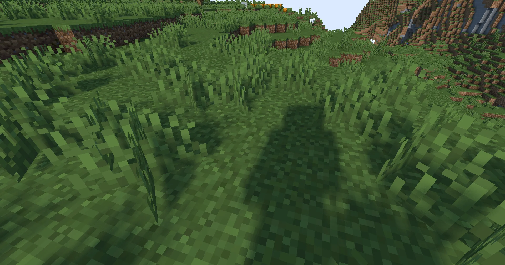

Our shadows no longer have any visible pixels!