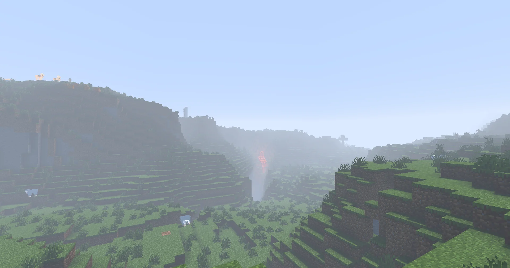
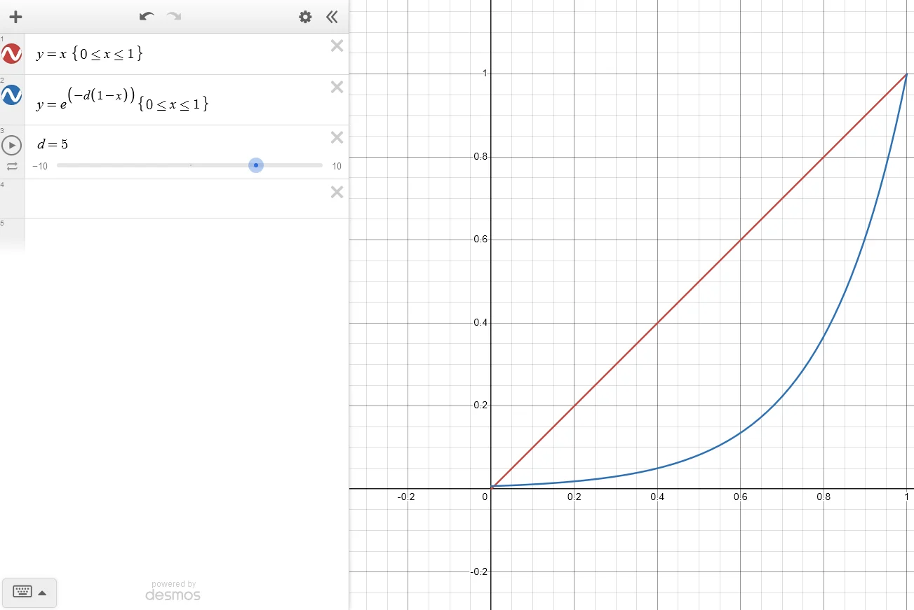
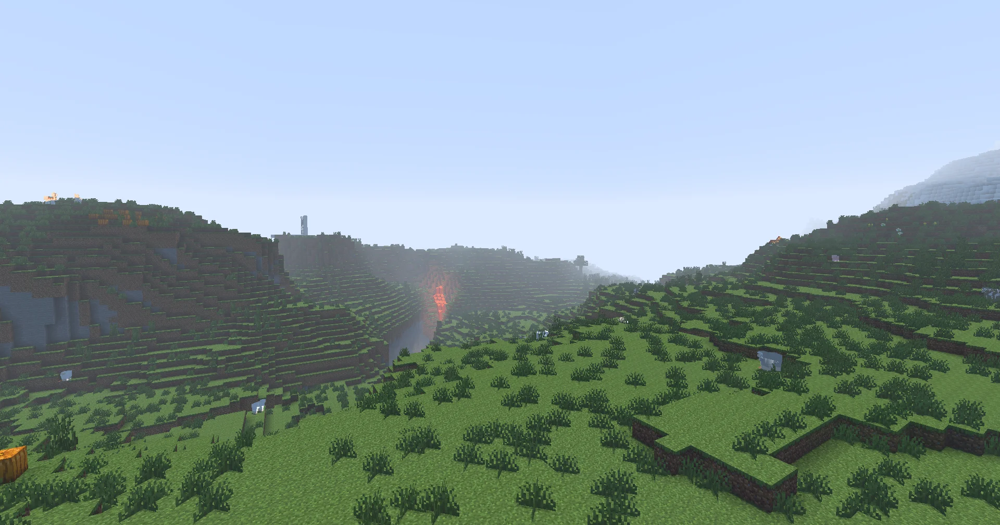

:::caution[Warning]
This tutorial is still being developed. Some statements may be incorrect, and things may change in the future. Got any feedback? [Comment on the tracking issue](https://github.com/IrisShaders/DocsPage/issues/327).
:::

In this section we will implement depth based fog, so that things seem to fade into the distance.

## Another `composite` Pass
To keep our code nicely organised, we will implement fog in a second post-processing pass, `composite1`. This pass will run after `composite`.

For our vertex shader, we can create a copy of `composite.vsh`, and rename it to `composite1.vsh`, as nothing we do in the vertex shader needs to change. For the fragment shader, we can also copy `composite.fsh`, but to keep our code clean, let's cut out all the fluff because we will not be doing lighting in this pass. We will, however, keep the `projectAndDivide` functions and the conversion to view space, as we will still need these.

```glsl
// composite1.fsh

#version 330 compatibility

#include "/lib/distort.glsl"

uniform sampler2D colortex0;
uniform sampler2D depthtex0;

uniform mat4 gbufferProjectionInverse;

in vec2 texcoord;

vec3 projectAndDivide(mat4 projectionMatrix, vec3 position){
  vec4 homPos = projectionMatrix * vec4(position, 1.0);
  return homPos.xyz / homPos.w;
}

/* DRAWBUFFERS:0 */
layout(location = 0) out vec4 color;

void main() {
	color = texture(colortex0, texcoord);

	float depth = texture(depthtex0, texcoord).r;
	if(depth == 1.0){
		return;
	}

  vec3 NDCPos = vec3(texcoord.xy, depth) * 2.0 - 1.0;
	vec3 viewPos = projectAndDivide(gbufferProjectionInverse, NDCPos);

}
```

:::tip[Pro Tip]
It's good practice to try to minimise duplicate code as much as possible. To organise your code better, consider moving functions like `projectAndDivide` to a file you can include wherever you need it, i.e `/lib/util.glsl`.
:::

## The Fog is Coming

What we want is for something which is nearly out of render distance to have lots of fog, and something which is close to the player not to have any fog at all. To do this, we can divide the distance from the player by a uniform `float`, [`far`](/reference/uniforms/general/far). The name of this variable is misleading, as what it gives us is the player's render distance, in blocks.

Of course, we also need to have a fog color to blend with, and for this, we'll use another uniform, a `vec3` [`fogColor`](/reference/uniforms/general/fogcolor).

We can then simply do

```glsl
color.rgb = mix(color.rgb, fogColor, length(viewPos)/far);
```

:::note[Note]
This works because we are still using the vanilla sky. If you go on to add a custom sky, you will likely want to choose your own fog color.
:::



And our terrain now nicely blends into the horizon.

## Fixing the Falloff

Right now, everything feels pretty spooky, with stuff even close by starting to blend into the fog. We can fix this by changing the function which maps the distance from the player to a fog density. We are going to use something known as exponential falloff, which comes in the form of `f = exp(-density * (1.0-distance))` where `distance` is some value between `0` and `1` and `density` is some value greater than `0`. `f` defines how much we mix with the fog.

:::note[Note]
This use of an exponential function for the falloff is based on a real physical law known as the [Beer-Lambert Law](https://www.edinst.com/blog/the-beer-lambert-law/).
:::

We can visualise this by plotting `f` against `distance` on a graph.



As you can see, the function curves nicely to make the fog seem further away.

Like we did before, let's define a fog density. I have chosen 5.

```glsl
#define FOG_DENSITY 5.0
```

We can then update our fog blending to make use of this value.
```glsl
float distance = length(viewPos) / far;
float fogFactor = exp(-FOG_DENSITY * (1.0 - distance));

color.rgb = mix(color.rgb, fogColor, clamp(fogFactor, 0.0, 1.0));
```

:::caution[Warning]
Note that we clamp the value of `fogFactor` between `0` and `1`. This is because the behaviour of `mix` is undefined if it is outside this range. Since the render distance in blocks is along three axes, blocks can be more than this distance away along the diagonals, so in some cases, `distance` could be more than `1`.
:::



And now our fog feels a lot more natural!
