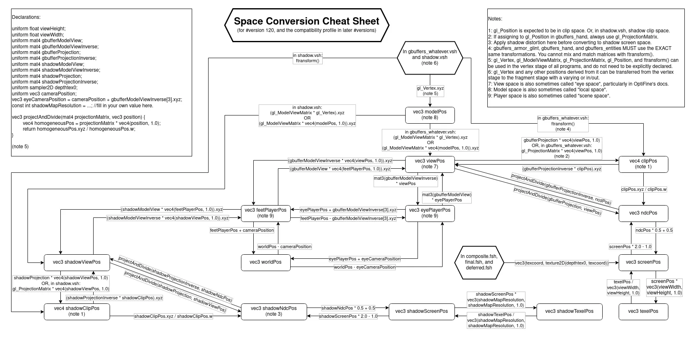

At the start of a shader program, the vertex position is provided in the form of `gl_Vertex` (or `VAPosition`). This position is in *model space*. By the time it reaches the fragment shader, the position is in *screen space*. Between these two are a number of other coordinate spaces.

**This page does not cover *clip space*, *NDC space*, or *screen space*, as these are applicable to all 3D graphics, not just Minecraft.** It is recommended that you also read the [LearnOpenGL article on coordinate systems](https://learnopengl.com/Getting-started/Coordinate-Systems) to gain a good understanding of these other spaces. The [shaderLABS Wiki](https://shaderlabs.org/wiki/Coordinate_Spaces) also has an explanation of different types of transformations, as well as an interactive visualiser of the different spaces.

## Space Conversion Cheatsheet
This page is designed to be read in tandem with this cheatsheet, which shows every space and how to convert between them.

**Source: [shaderLABS Wiki](https://shaderlabs.org/wiki/Coordinate_Spaces)**

## Spaces

### Model Space
In Iris (and Optifine), *model space* is whatever coordinate space the vertex position attribute is sent in. The exact coordinate space varies based on the specific geometry, and has the potential to vary across different Minecraft versions. As a result, it is always recommended to treat *model space* like an unknown space and convert to view space with the `gl_ModelViewMatrix`/[`modelViewMatrix`](/reference/uniforms/matrices/modelviewmatrix). *Model space* is also sometimes known as '*local space*'.


If using the core profile (and as such using [`vaPosition`](/reference/attributes/vaposition) instead of `gl_Vertex`), the *model space* position for terrain should be offset with [`chunkOffset`](/reference/uniforms/general/chunkoffset). The conversion sheet assumes this has already been done. Here's an example of what that should look like:
```glsl
vec3 model_pos = vaPosition + chunkOffset;
```

### View Space
*View space* is the vertex position relative to the camera. This is also sometimes known as '*eye space*' (not to be confused with '*eye player space*').

The `x` and `y` components of view space line up with screenspace (negative is left/down, positive is right/up), however the `z` coordinate is "backwards" (forward is negative z).

### Player Space
*Player space* is the vertex position relative to the *camera* (not the player). The difference between view and *player space* is that whilst *view space* directions change based on the camera angle, *player space* directions are constant, aligned to the axes of Minecraft's coordinates. For example, a vector `0.0, 1.0, 0.0` is along the Y axis and as such would be along Minecraft's actual Y axis (upwards).

To get a position which is relative to the actual player model in third person, you can use [`relativeEyePosition`](/reference/uniforms/general/relativeeyeposition).

#### Feet and Eye Player Space
The names of these spaces are misleading, as '*feet player space*' is not in any way related to the player's feet. The difference between the two is that in *feet player space*, the origin remains locked to the player's head position, whereas in *eye player space*, effects like view bobbing are accounted for, meaning that the origin is locked to the camera. This is why the two can be interchanged with the addition and subtraction of [`gbufferModelViewInverse[3]`](/reference/uniforms/matrices/gbuffermodelviewinverse) - this fourth component of the matrix accounts for the translation from the player's head to the camera.

It is also worth noting that in third person mode, view bobbing is disabled, and as such, *eye* and *feet player space* are *usually* identical.

### World Space
*World space* is the vertex position in Minecraft's actual coordinate system. It is directionally equivalent to *player space*, as it is simply the result of offsetting a *feet player space* position by the camera position. This roughly lines up with the game's actual coordinate positions, however [`cameraPosition`](/reference/uniforms/general/cameraposition) resets every 30000 blocks (or every 1000 blocks when teleporting). If the exact Minecraft position is required, [`cameraPositionInt`](/reference/uniforms/general/camerapositionint) and [`cameraPositionFract`](/reference/uniforms/general/camerapositionfract) can be used

## Shadow Space
'Shadow Space' can refer to a number of different coordinate spaces, all of which are used for the [shadow pass](/reference/programs/shadow). As such, the "shadow" versions of coordinate spaces are generally equivalent to their normal versions but from the perspective of the shadow camera (the sun/moon). The shadow spaces include *shadow view space*, *shadow clip space*, *shadow NDC space*, and *shadow screen space*.

In the [shadow pass](/reference/programs/shadow), the same base matrices are used ([`modelViewMatrix`](/reference/uniforms/matrices/modelviewmatrix), [`projectionMatrix`](/reference/uniforms/matrices/projectionmatrix), etc), or the `shadow` matrix uniforms (e.g. [`shadowModelView`](/reference/uniforms/matrices/shadowmodelview), [`shadowProjection`](/reference/uniforms/matrices/shadowprojection)) can be used from any program. When sampling the shadow map, positions can be transformed into *player space*, and from there back into *shadow screen space*.